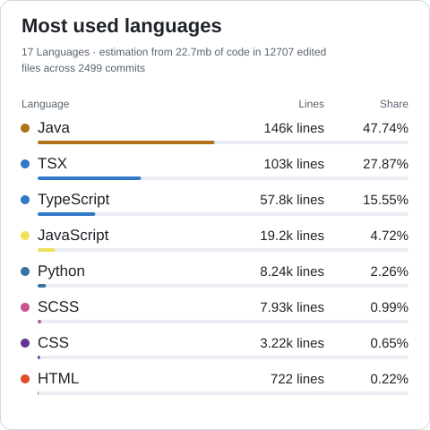

# MinJun Shin

**End-to-End, Full-stack Developer**

[포트폴리오 링크](https://portfolio-six-bice-59.vercel.app/) · [Email](mailto:ed125248@gmail.com)

## Hello

안녕하세요! 저는 문제의 본질을 이해하고, 기능을 넘어 운영까지 설계하는 개발자 신민준입니다.

## Tech Stack

| 분야 | 기술 |
| :--- | :--- |
| **Languages** |  TypeScript &nbsp;  JavaScript &nbsp;  Java &nbsp;  Python |
| **Frontend** |  React &nbsp;  Next.js &nbsp;  Tailwind CSS HTML5 · CSS3 · Zustand · TanStack Query |
| **Backend** |  Node.js &nbsp;  Express &nbsp;  NestJS Java / Spring Boot · Python / FastAPI |
| **Data** |  PostgreSQL &nbsp;  MySQL &nbsp;  Redis SQL · Prisma · Spring Data JPA · QueryDSL |
| **AI** | LangGraph |
| **Infrastructure** |  Docker &nbsp;  NGINX &nbsp;  Ubuntu AWS · GitHub Actions |
| **Tools** |  Git &nbsp;  GitHub &nbsp;  Notion &nbsp;  Discord |

## Strengths

### 1. 문제를 정의하고 구조로 해결합니다

- 주어진 요구사항을 그대로 구현하기보다, 왜 이 문제가 발생했는지부터 정의
- UX, 성능, 운영 관점에서 문제를 재정의하고 구조적으로 해결하는 방식을 선호합니다

### 2. 기술 선택의 이유를 설명할 수 있습니다

- 익숙함이 아닌 상황에 맞는 선택을 기준으로 기술을 결정합니다
- SSR/CSR 분리, SQL View 활용, CI/CD 도입 등 → 선택의 트레이드오프를 인지하고 판단합니다

### 3. 운영을 고려한 개발을 지향합니다

- 로컬 구현에서 끝내지 않고 배포·운영 환경까지 함께 설계
- Docker, CI/CD, 로깅, 서버 환경 구성 등 → 실제 서비스 운영을 기준으로 개발 경험을 쌓아왔습니다

## Career

| 기간 | 내용 |
| :--- | :--- |
| 2025.06 ~ 2026.01 | **코드잇 스프린트** — 풀스택 8기 (수료) |

## GitHub Stats

  

  

## Portfolio

🔗 [포트폴리오 링크](https://portfolio-six-bice-59.vercel.app/)

## Contact

**Email** — [ed125248@gmail.com](mailto:ed125248@gmail.com)

---

<strong>© 2026 MinJun Shin.</strong> All rights reserved.

